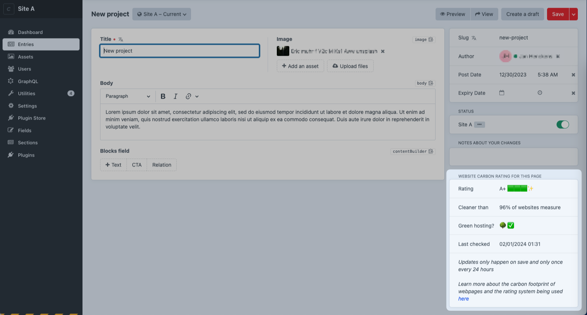

# Carbon Emission Tracker for Craft CMS

Carbon tracker aims to raise awareness of the carbon emissions created by webpages, by displaying these insights along side the content in Craft's control panel.

The plugin uses the [websitecarbon.com API](https://www.websitecarbon.com/) (we're not affiliated, although we do consider them friends 💚), and will only check for new metrics once every 24 hours. **That means you won't see new metrics for every update or change you make** - as that would result in lots of API calls, defeating the purpose of keeping our footprint as small as possible 🙂.

## How does it work?

When publishing a new page, the plugin will call the [websitecarbon.com](https://www.websitecarbon.com) API with the url of the page in question (this is done through a queue job as to not block the user) and a couple of minutes later, you'll see a new block appear in the sidebar of the entry detail page.



### Local development 
When you install the plugin on a local environment, it will always use websitecarbon.com as the url for which to get the current score, since the API needs a publicly available url)

--- 
## Requirements
This plugin requires Craft CMS 4.5.0 or later, and PHP 8.0.2 or later.

## Installation

You can install this plugin from the Plugin Store or with Composer.

#### From the Plugin Store

Go to the Plugin Store in your project’s Control Panel and search for “carbon-tracker”. Then press “Install”.

#### With Composer

Open your terminal and run the following commands:

```bash
# go to the project directory
cd /path/to/my-project.test

# tell Composer to load the plugin
composer require statikbe/craft-carbon-tracker

# tell Craft to install the plugin
./craft plugin/install carbon-tracker
```
